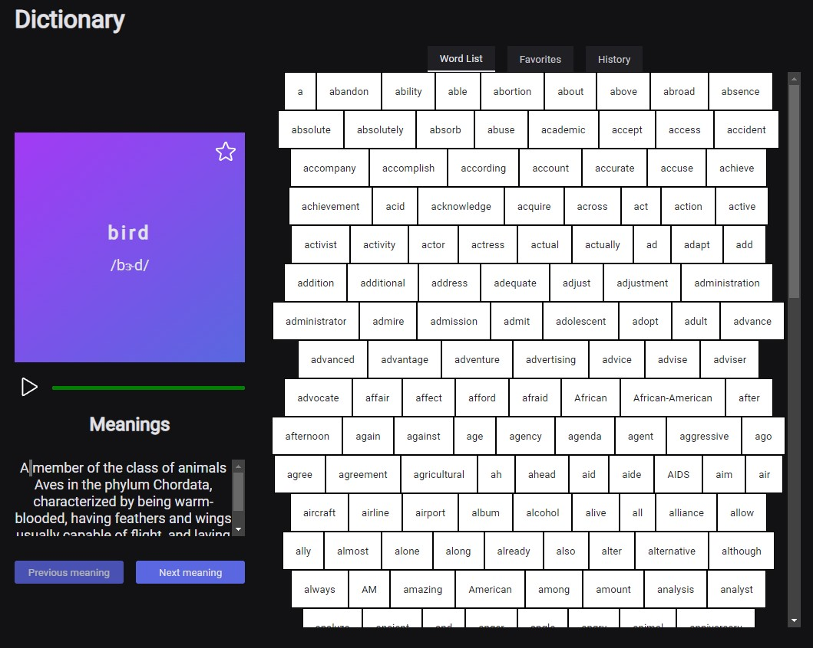

<div align="center" id="top"> 
  

  &#xa0;

  <a href="https://next-dictionary.vercel.app/">Demo</a> 
</div>

<h1 align="center">Next Dictionary</h1>

<p align="center">
  

  

  

  

  <!--  -->

  <!--  -->

  <!--  -->
</p>

<!-- Status -->

<!-- <h4 align="center"> 
	🚧  Next Dictionary 🚀 Em construção...  🚧
</h4> 

<hr> -->

<p align="center">
  <a href="#dart-sobre">Sobre</a> &#xa0; | &#xa0; 
  <a href="#sparkles-funcionalidades">Funcionalidades</a> &#xa0; | &#xa0;
  <a href="#rocket-tecnologias">Tecnologias</a> &#xa0; | &#xa0;
  <a href="#white_check_mark-pré-requisitos">Pré requisitos</a> &#xa0; | &#xa0;
  <a href="#checkered_flag-começando">Começando</a> &#xa0; | &#xa0;
  <a href="#memo-licença">Licença</a> &#xa0; | &#xa0;
  <a href="https://github.com/imnotvirus" target="_blank">Autor</a>
</p>

<br>

## :dart: Sobre ##

Dicionario English, com fonéticas, significados e pronuncias.

## :sparkles: Funcionalidades ##

:heavy_check_mark: Listagem de palavras;\
:heavy_check_mark: Exibição de fonética;\
:heavy_check_mark: Exibição de significados;\
:heavy_check_mark: Reprodução do audio da palavra;\
:heavy_check_mark: Listagem do histórico das palavras;\
:heavy_check_mark: Favoritar e des-favoritar palavras;\
:heavy_check_mark: Listagem do palavras favoritadas;\
:heavy_check_mark: Listagem do palavras favoritadas;\
:heavy_check_mark: Atualização da URL para compartilhar palavra;

## :rocket: Tecnologias ##

As seguintes ferramentas foram usadas na construção do projeto:

- [NextJS](https://nextjs.org/)
- [ReactJs](https://reactjs.org/)
- [Supabase](https://supabase.com/)
- [Stitches](https://stitches.dev/)
- [Axios](https://axios-http.com/)
- [TypeScript](https://www.typescriptlang.org/)
- [Phosphor-icons](https://phosphoricons.com/)
- [SWR](https://swr.vercel.app/)

## :white_check_mark: Pré requisitos ##

Antes de começar :checkered_flag:, você precisa ter o [Git](https://git-scm.com) e o [Node](https://nodejs.org/en/) instalados em sua maquina.
Criar uma conta no Supabase, criar uma lista de palavras com ids únicos, colocar no .env (da forma que está no .env.example) a base url e a key. 
MUITO IMPORTANTE!!!! O NOME DA TABELA TEM QUE SER wordlist (OU ENTÃO VOCÊ PODE ALTERAR NO ARQUIVO /src/pages/api/supabase.ts)
## :checkered_flag: Começando ##

```bash
# Clone este repositório
$ git clone https://github.com/imnotvirus/next-dictionary

# Entre na pasta
$ cd next-dictionary

# Instale as dependências
$ yarn

# Para "buildar" o projeto
$ yarn build

# Para "rodar" o projeto
$ yarn start

# O app vai inicializar em <http://localhost:3000>
```

## :memo: Licença ##

Este projeto está sob licença MIT. Veja o arquivo [LICENSE](LICENSE.md) para mais detalhes.


Feito com :heart: por <a href="https://github.com/imnotvirus" target="_blank">Luiz Claudio</a>

>  This is a challenge by [Coodesh](https://coodesh.com/)


&#xa0;

<a href="#top">Voltar para o topo</a>
